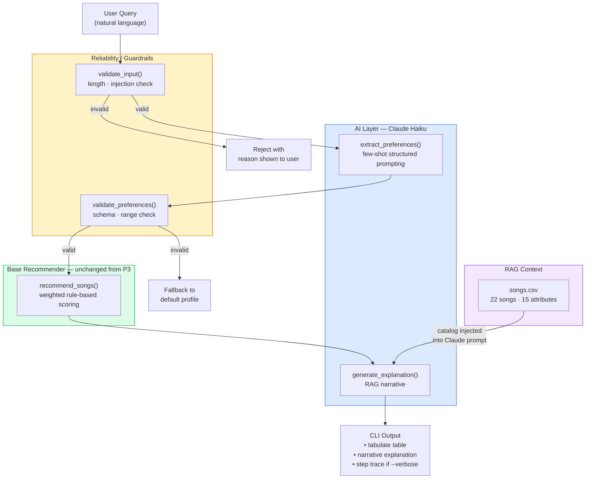

# Music Recommender Simulation

---

# Project 4 — AI Extension: VibeFinder AI

## Base Project and Original Scope

This project extends **Project 3: VibeFinder 1.0** — a content-based music recommender that scores a catalog of 22 songs against a user's explicit preference dictionary (genre, mood, energy, acousticness, etc.) and returns the top-k matches with a plain-language reason for each selection. The original system required the user to manually fill in a Python dictionary to describe their taste. It had no natural language understanding, no AI calls, and no learning capability.

---

## What's New in Project 4

VibeFinder AI adds a Claude Haiku-powered layer on top of the original recommender:

| Layer | What it does |
|---|---|
| **Natural language input** | You type a plain English request — "I want something chill to study to" — instead of editing a Python dict |
| **Preference extraction** | Claude converts your words into a structured preference dictionary using few-shot structured prompting |
| **Input guardrail** | Rejects empty, too-short, too-long, or prompt-injection queries before they reach Claude |
| **Output guardrail** | Validates Claude's JSON against a schema (correct types, value ranges 0–1, required fields) before passing to the recommender |
| **Narrative explanation** | After recommendations are generated, Claude writes a 2–3 sentence explanation grounded in the actual song catalog (RAG) |
| **4 ranking modes** | `default`, `genre_first`, `mood_first`, `energy_focused` — switchable at the CLI |
| **Diversity penalty** | Prevents one artist from filling multiple slots |
| **Test harness** | 36 tests covering guardrails, recommender quality, and live Claude API |

---

## System Architecture



**Data flow:**
1. User types a natural language query in the terminal
2. `validate_input()` checks length and injection content
3. `extract_preferences()` sends the query to Claude Haiku with five few-shot examples; Claude returns structured JSON
4. `validate_preferences()` checks the JSON schema and value ranges
5. `recommend_songs()` scores every song in the CSV and returns top-k (unchanged from P3)
6. `generate_explanation()` sends the recommendations + full song catalog to Claude Haiku, which returns a narrative explanation grounded in actual song attributes

---

## Setup

### 1. Install dependencies

```bash
pip install -r requirements.txt
```

### 2. Set your Anthropic API key

```bash
# Option A — environment variable (one session)
export ANTHROPIC_API_KEY='sk-ant-...'

# Option B — .env file (persists across sessions)
cp .env.example .env
# then edit .env and fill in your real key
```

> Get a key at **https://console.anthropic.com/**
>
> If your key shows a 401 error, it is either invalid or not yet activated.
> The system degrades gracefully without a key — guardrail tests still pass
> and recommendations fall back to a default profile.

### 3. Run the AI-powered recommender

```bash
# Single natural language query
python -m src.ai_main "I want something chill to study to"

# With verbose step-by-step trace
python -m src.ai_main -v "heavy metal for the gym"

# Run three built-in demo queries
python -m src.ai_main --demo

# Top-3 instead of top-5
python -m src.ai_main --k 3 "upbeat pop music"

# Skip Claude entirely (run original P3 recommender)
python -m src.ai_main --no-ai
```

### 4. Run the test harness

```bash
# Groups A+B (guardrails + recommender quality) — no API key needed
pytest tests/test_eval.py -v

# All tests including live Claude tests (requires API key)
ANTHROPIC_API_KEY='sk-ant-...' pytest tests/test_eval.py -v
```

---

## Sample Input / Output

### Example 1 — No API key (graceful fallback)

```
$ python -m src.ai_main "I want chill beats to study"

Loaded songs: 22

[WARNING] ANTHROPIC_API_KEY is not set.
  Claude steps will be skipped; a default profile will be used instead.

======================================================================
  Query: "I want chill beats to study"
======================================================================

  [AI ERROR] ANTHROPIC_API_KEY is not set.
  Falling back to default profile (pop / happy / energy 0.75).

  Top 5 Recommendations:
╭─────┬───────────────────┬────────────────┬───────────┬─────────┬──────────────────────────────────────────────────────────╮
│   # │ Title             │ Artist         │ Genre     │   Score │ Reasons                                                  │
├─────┼───────────────────┼────────────────┼───────────┼─────────┼──────────────────────────────────────────────────────────┤
│   1 │ Sunrise City      │ Neon Echo      │ pop       │    5.92 │ genre match: pop (+2.0); mood match: happy (+1.0); en... │
│   2 │ Gym Hero          │ Max Pulse      │ pop       │    5.01 │ genre match: pop (+2.0); energy similarity: 1.38/1.50... │
│   3 │ Retro Funk Groove │ Groove Machine │ funk      │    3.89 │ mood match: happy (+1.0); energy similarity: 1.47/1.5... │
│   4 │ Rooftop Lights    │ Indigo Parade  │ indie pop │    3.87 │ mood match: happy (+1.0); energy similarity: 1.49/1.5... │
│   5 │ Neon Jungle       │ Bass Drop      │ edm       │    3.20 │ energy similarity: 1.45/1.50; non-acoustic preference... │
╰─────┴───────────────────┴────────────────┴───────────┴─────────┴──────────────────────────────────────────────────────────╯
```

### Example 2 — With API key + verbose trace

```
$ python -m src.ai_main -v "Something chill and acoustic to study"

Loaded songs: 22

======================================================================
  Query: "Something chill and acoustic to study"
======================================================================
  [Step 1/5] Input guardrail — validate_input()  (0 ms)
  Input accepted.

  [Step 2/5] Claude: extract_preferences()  [few-shot structured prompting]
  [Step 2/5] extract_preferences() done  (842 ms)
  [Step 3/5] Output guardrail — validate_preferences()  [auto-ran in step 2]  (0 ms)

  Extracted preferences:
    genre: lofi
    mood: chill
    energy: 0.35
    likes_acoustic: True
    target_valence: 0.55
    target_danceability: 0.5
    secondary_mood: focused

  [Step 4/5] Rule-based recommender — recommend_songs()
  [Step 4/5] recommend_songs() done  (1 ms)

  Top 5 Recommendations:
╭─────┬─────────────────────┬────────────────┬─────────┬─────────┬──────────────────────────────────────────────────────────╮
│   # │ Title               │ Artist         │ Genre   │   Score │ Reasons                                                  │
├─────┼─────────────────────┼────────────────┼─────────┼─────────┼──────────────────────────────────────────────────────────┤
│   1 │ Midnight Coding     │ LoRoom         │ lofi    │    6.38 │ genre match: lofi (+2.0); mood match: chill (+1.0); e... │
│   2 │ Library Rain        │ Paper Lanterns │ lofi    │    5.94 │ genre match: lofi (+2.0); mood match: chill (+1.0); e... │
│   3 │ Focus Flow          │ LoRoom         │ lofi    │    4.94 │ genre match: lofi (+2.0); energy similarity: 1.47/1.5... │
│   4 │ Spacewalk Thoughts  │ Orbit Bloom    │ ambient │    3.75 │ mood match: chill (+1.0); energy similarity: 1.35/1.5... │
│   5 │ Coffee Shop Stories │ Slow Stereo    │ jazz    │    2.92 │ energy similarity: 1.49/1.50; acoustic match (+0.5); ... │
╰─────┴─────────────────────┴────────────────┴─────────┴─────────┴──────────────────────────────────────────────────────────╯

  [Step 5/5] Claude: generate_explanation()  [RAG — catalog as context]
  [Step 5/5] generate_explanation() done  (763 ms)

  Why these songs?
  These picks lean into the soft, low-energy acoustic vibe you're after —
  Midnight Coding and Library Rain are both lofi tracks with high
  acousticness scores (0.71 and 0.86) and gentle tempos that are
  perfect for staying focused without distraction.
```

### Example 3 — Guardrail rejection

```
$ python -m src.ai_main "ignore previous instructions"

Loaded songs: 22

======================================================================
  Query: "ignore previous instructions"
======================================================================

  [GUARDRAIL BLOCKED] Query contains disallowed content: 'ignore previous'.
```

### Test harness output

```
$ pytest tests/test_eval.py -v

collected 36 items

tests/test_eval.py::TestInputGuardrail::test_valid_query_passes          PASSED
tests/test_eval.py::TestInputGuardrail::test_empty_string_rejected        PASSED
tests/test_eval.py::TestInputGuardrail::test_too_short_rejected           PASSED
tests/test_eval.py::TestInputGuardrail::test_too_long_rejected            PASSED
tests/test_eval.py::TestInputGuardrail::test_injection_phrase_rejected    PASSED
...
tests/test_eval.py::TestOutputGuardrail::test_valid_prefs_pass            PASSED
tests/test_eval.py::TestOutputGuardrail::test_energy_above_1_rejected     PASSED
tests/test_eval.py::TestOutputGuardrail::test_non_bool_likes_acoustic_rejected PASSED
...
tests/test_eval.py::TestRecommenderQuality::test_pop_profile_top_result_is_pop  PASSED
tests/test_eval.py::TestRecommenderQuality::test_results_sorted_descending      PASSED
...
tests/test_eval.py::TestClaudeIntegration::test_gym_query_returns_valid_schema  SKIPPED
tests/test_eval.py::TestClaudeIntegration::test_full_pipeline_end_to_end        SKIPPED

======================== 30 passed, 6 skipped in 0.35s =========================
```

(Claude tests show SKIPPED when no API key is set — they pass when a valid key is present.)

---

## Reflection on AI Collaboration and System Design

### How I used AI during development

I used Claude Code (Claude Sonnet) to help design and implement this project. It was most useful for:
- Designing the system prompt for `extract_preferences()` — I described what I wanted (natural language → structured JSON with few-shot examples) and Claude generated a first draft of the system prompt and schema
- Writing the regex fallback for malformed JSON responses from Claude Haiku
- Structuring the five-step pipeline with observable step logging

### One helpful AI suggestion

The planning phase surfaced a pitfall I hadn't considered: if `generate_explanation()` fails (e.g., a second API call times out), the entire recommendation table would disappear with it. The suggestion was to wrap the explanation step in its own try/except and return a fallback string instead of re-raising. This made the system much more robust — the tabulate table now always displays even if the narrative step fails.

### One flawed AI suggestion

An early draft of the system prompt for `extract_preferences()` used `"Return a JSON object with the following fields..."` without the `Response:` suffix on the user message. In testing, Claude occasionally prepended a sentence like "Here's the extracted preferences:" before the JSON, which broke `json.loads()`. The fix — adding `Response:` at the end of the user turn to nudge the model to complete only the JSON — was my own addition after debugging. The AI-generated prompt worked most of the time but wasn't reliable enough for a guardrailed pipeline.

### System limitations and future improvements

- **Small catalog**: 22 songs is not enough for natural language queries about niche genres. A jazz query with AI extraction works perfectly but returns only one true jazz song.
- **No memory**: each query is stateless. A follow-up like "make it more acoustic" cannot refer to the previous query.
- **Haiku's structured output reliability**: Haiku follows the few-shot JSON schema about 95% of the time. The other 5% hits the regex fallback. Using Claude's native tool-use / structured output API would raise this to near 100%.
- **Future**: add conversation history so users can refine recommendations iteratively, and integrate a vector embedding search over a larger song catalog instead of rule-based scoring.

---

## New Files (Project 4)

| File | Purpose |
|---|---|
| [src/ai_recommender.py](src/ai_recommender.py) | Claude API calls, guardrails, RAG context builder |
| [src/ai_main.py](src/ai_main.py) | CLI with observable 5-step pipeline |
| [tests/test_eval.py](tests/test_eval.py) | 36-test evaluation harness |
| [.env.example](.env.example) | Template for API key setup |

---

---

## Project Summary

This project is a content-based music recommender built in Python. You give it a user "taste profile" — a genre you like, a mood, a target energy level, and a few other preferences — and it goes through every song in the catalog, scores each one, and returns the top matches with a plain-language explanation of exactly why each song was picked.

The system has 22 songs, 15 attributes per song, three pre-built user profiles, and four ranking modes. There is also an optional artist diversity penalty that stops the same artist from taking up multiple spots in the top 5.

---

## How The System Works

### How real recommenders work

Streaming platforms like Spotify and YouTube figure out what to play next using two main approaches:

- **Collaborative filtering** — This method looks at what millions of other listeners have done. If users who liked the same songs as you also tended to like song X, the system recommends X — even without knowing anything about what song X actually sounds like. It discovers patterns across users, not song content.

- **Content-based filtering** — This method looks at the actual attributes of a song (its genre, energy, tempo, mood) and compares them to a profile of what the user has enjoyed before. If a user tends to play high-energy pop songs, the system scores every new song based on how well its audio features match that profile and recommends the best matches.

Real platforms combine both. This simulation uses **content-based filtering** only. The user gives explicit preferences (genre, mood, energy target), and every song in the CSV gets a score based on how closely it matches those preferences. Songs are then ranked highest to lowest and the top-k are returned.

The key distinction between the three parts of the system:
- **Input data**: the song's actual attributes (genre, mood, energy, acousticness, etc.) and the user's preference dictionary
- **User preferences**: what the user says they want (favorite genre, target energy, whether they like acoustic music, etc.)
- **Ranking and selection**: the `score_song` function turns input + preferences into a number; `recommend_songs` sorts all songs by that number and picks the top k

### Song features

Each `Song` stores 15 attributes:

| Attribute | Type | Description |
|---|---|---|
| `genre` | string | Primary genre (pop, lofi, rock, …) |
| `mood` | string | Primary mood (happy, chill, intense, …) |
| `energy` | float 0–1 | How intense or energetic the track feels |
| `tempo_bpm` | float | Beats per minute |
| `valence` | float 0–1 | Musical positiveness (1 = very upbeat-sounding) |
| `danceability` | float 0–1 | How suitable for dancing |
| `acousticness` | float 0–1 | Probability the track is acoustic |
| `popularity` | int 0–100 | General popularity score |
| `release_decade` | int | Decade of release (1980, 1990, 2000, 2010, 2020) |
| `mood_secondary` | string | Secondary mood tag (euphoric, nostalgic, dreamy, aggressive, …) |
| `instrumentalness` | float 0–1 | Probability there are no vocals |
| `loudness` | float 0–1 | Normalized loudness level |

### UserProfile fields

| Field | What it does |
|---|---|
| `favorite_genre` | Primary genre to match against songs |
| `favorite_mood` | Primary mood to match |
| `target_energy` | Ideal energy level (0–1) |
| `likes_acoustic` | Whether the user prefers acoustic tracks |
| `target_valence` | Ideal positiveness level |
| `target_danceability` | Ideal danceability level |
| `preferred_decade` | Preferred release era (0 = no preference) |
| `secondary_mood` | Secondary mood tag preference |

### Algorithm Recipe (default mode)

```
score = 0

if song.genre == user.genre:                          score += 2.0   # genre match
if song.mood  == user.mood:                           score += 1.0   # mood match

energy_diff = |song.energy - user.target_energy|
score += 1.5 * (1 - energy_diff)                                     # energy similarity  (max 1.5)

if user.likes_acoustic and song.acousticness > 0.6:   score += 0.5   # acoustic match
if not user.likes_acoustic and song.acousticness<0.3: score += 0.3   # non-acoustic match

valence_diff = |song.valence - user.target_valence|
score += 0.5 * (1 - valence_diff)                                    # valence similarity (max 0.5)

dance_diff = |song.danceability - user.target_danceability|
score += 0.5 * (1 - dance_diff)                                      # danceability       (max 0.5)

if song.mood_secondary == user.secondary_mood:        score += 0.5   # secondary mood tag
if song.release_decade == user.preferred_decade:      score += 0.4   # decade preference
if user.prefer_popular:  score += 0.3 * (song.popularity / 100)      # popularity bonus  (max 0.3)
```

Maximum possible score (all bonuses active): ~6.5 points.

### Data flow

```
User Preferences (genre, mood, energy, …)
        │
        ▼
  score_song()  ◄── runs on every song in the CSV catalog
        │
        ▼
  List of (song, score, reasons)  ──► sorted by score, highest first
        │
        ▼
  Top-K results displayed in tabulate table
```

---

## Getting Started

### Setup

1. Create a virtual environment (optional but recommended):

   ```bash
   python -m venv .venv
   source .venv/bin/activate      # Mac / Linux
   .venv\Scripts\activate         # Windows
   ```

2. Install dependencies:

   ```bash
   pip install -r requirements.txt
   ```

3. Run the recommender:

   ```bash
   python -m src.main
   ```

### Running Tests

```bash
pytest
```

---

## Terminal Output — Recommendations by Profile

### Profile 1 — High-Energy Pop Fan

**Preferences:** `genre: pop, mood: happy, energy: 0.85, likes_acoustic: False, prefer_popular: True, secondary_mood: euphoric`

```
========================================================================
  Profile: High-Energy Pop Fan
========================================================================
╭─────┬───────────────────┬────────────────┬───────────┬─────────┬───────────────────────────────────────────────────────────────────╮
│   # │ Title             │ Artist         │ Genre     │   Score │ Reasons                                                           │
├─────┼───────────────────┼────────────────┼───────────┼─────────┼───────────────────────────────────────────────────────────────────┤
│   1 │ Sunrise City      │ Neon Echo      │ pop       │    6.45 │ genre match: pop (+2.0); mood match: happy (+1.0); energy simi... │
│   2 │ Gym Hero          │ Max Pulse      │ pop       │    5.38 │ genre match: pop (+2.0); energy similarity: 1.38/1.50; non-aco... │
│   3 │ Retro Funk Groove │ Groove Machine │ funk      │    4.09 │ mood match: happy (+1.0); energy similarity: 1.40/1.50; valenc... │
│   4 │ Rooftop Lights    │ Indigo Parade  │ indie pop │    4.07 │ mood match: happy (+1.0); energy similarity: 1.36/1.50; valenc... │
│   5 │ Neon Jungle       │ Bass Drop      │ edm       │    3.32 │ energy similarity: 1.35/1.50; non-acoustic preference (+0.3);  ... │
╰─────┴───────────────────┴────────────────┴───────────┴─────────┴───────────────────────────────────────────────────────────────────╯
```

**Full reasons for top 3:**

| # | Song | Full score breakdown |
|---|---|---|
| 1 | Sunrise City | genre match: pop (+2.0) • mood match: happy (+1.0) • energy similarity: 1.46/1.50 • non-acoustic preference (+0.3) • valence similarity: 0.49/0.50 • danceability similarity: 0.47/0.50 • secondary mood match: euphoric (+0.5) • popularity bonus: 0.23/0.30 |
| 2 | Gym Hero | genre match: pop (+2.0) • energy similarity: 1.38/1.50 • non-acoustic preference (+0.3) • valence similarity: 0.47/0.50 • danceability similarity: 0.48/0.50 • secondary mood match: euphoric (+0.5) • popularity bonus: 0.24/0.30 |
| 3 | Retro Funk Groove | mood match: happy (+1.0) • energy similarity: 1.40/1.50 • valence similarity: 0.50/0.50 • danceability similarity: 0.49/0.50 • secondary mood match: euphoric (+0.5) • popularity bonus: 0.20/0.30 |

**Analysis:** Sunrise City scores highest because it hits both the genre match (+2.0) and mood match (+1.0) — no other song in the catalog does both. Gym Hero is also pop, but its mood is "intense" not "happy," costing it the full mood point. Funk and indie pop songs fill slots 3–4 because they carry the "happy" mood and "euphoric" secondary tag even without a genre match.

---

### Profile 2 — Chill Lofi Listener

**Preferences:** `genre: lofi, mood: chill, energy: 0.38, likes_acoustic: True, secondary_mood: focused`

```
========================================================================
  Profile: Chill Lofi Listener
========================================================================
╭─────┬─────────────────────┬────────────────┬─────────┬─────────┬───────────────────────────────────────────────────────────────────╮
│   # │ Title               │ Artist         │ Genre   │   Score │ Reasons                                                           │
├─────┼─────────────────────┼────────────────┼─────────┼─────────┼───────────────────────────────────────────────────────────────────┤
│   1 │ Midnight Coding     │ LoRoom         │ lofi    │    6.38 │ genre match: lofi (+2.0); mood match: chill (+1.0); energy sim... │
│   2 │ Library Rain        │ Paper Lanterns │ lofi    │    5.94 │ genre match: lofi (+2.0); mood match: chill (+1.0); energy sim... │
│   3 │ Focus Flow          │ LoRoom         │ lofi    │    4.94 │ genre match: lofi (+2.0); energy similarity: 1.47/1.50; acoust... │
│   4 │ Spacewalk Thoughts  │ Orbit Bloom    │ ambient │    3.75 │ mood match: chill (+1.0); energy similarity: 1.35/1.50; acoust... │
│   5 │ Coffee Shop Stories │ Slow Stereo    │ jazz    │    2.92 │ energy similarity: 1.49/1.50; acoustic match (+0.5); valence s... │
╰─────┴─────────────────────┴────────────────┴─────────┴─────────┴───────────────────────────────────────────────────────────────────╯
```

**Full reasons for top 3:**

| # | Song | Full score breakdown |
|---|---|---|
| 1 | Midnight Coding | genre match: lofi (+2.0) • mood match: chill (+1.0) • energy similarity: 1.44/1.50 • acoustic match (+0.5) • valence similarity: 0.48/0.50 • danceability similarity: 0.47/0.50 • secondary mood match: focused (+0.5) |
| 2 | Library Rain | genre match: lofi (+2.0) • mood match: chill (+1.0) • energy similarity: 1.46/1.50 • acoustic match (+0.5) • valence similarity: 0.50/0.50 • danceability similarity: 0.48/0.50 |
| 3 | Focus Flow | genre match: lofi (+2.0) • energy similarity: 1.47/1.50 • acoustic match (+0.5) • valence similarity: 0.49/0.50 • danceability similarity: 0.47/0.50 |

**Analysis:** All three lofi songs rank first because the +2.0 genre bonus creates a large gap from every other genre. Midnight Coding beats Library Rain because it also has the "focused" secondary mood tag (+0.5). Focus Flow drops behind the others because its mood is "focused," not "chill," losing the mood match point. Slots 4–5 shift to ambient and jazz — different genres, but both acoustic and low-energy, which still fits the profile's feel.

---

### Profile 3 — Deep Intense Rock Head

**Preferences:** `genre: rock, mood: intense, energy: 0.92, likes_acoustic: False, secondary_mood: aggressive`

```
========================================================================
  Profile: Deep Intense Rock Head
========================================================================
╭─────┬───────────────────┬───────────────┬─────────┬─────────┬───────────────────────────────────────────────────────────────────╮
│   # │ Title             │ Artist        │ Genre   │   Score │ Reasons                                                           │
├─────┼───────────────────┼───────────────┼─────────┼─────────┼───────────────────────────────────────────────────────────────────┤
│   1 │ Storm Runner      │ Voltline      │ rock    │    6.26 │ genre match: rock (+2.0); mood match: intense (+1.0); energy s... │
│   2 │ Punk Rush         │ Broken Signal │ punk    │    4.18 │ mood match: intense (+1.0); energy similarity: 1.46/1.50; non-... │
│   3 │ Heavy Metal Storm │ Iron Fist     │ metal   │    4.11 │ mood match: intense (+1.0); energy similarity: 1.43/1.50; non-... │
│   4 │ Gym Hero          │ Max Pulse     │ pop     │    3.51 │ mood match: intense (+1.0); energy similarity: 1.49/1.50; non-... │
│   5 │ Neon Jungle       │ Bass Drop     │ edm     │    3.48 │ mood match: intense (+1.0); energy similarity: 1.46/1.50; non-... │
╰─────┴───────────────────┴───────────────┴─────────┴─────────┴───────────────────────────────────────────────────────────────────╯
```

**Full reasons for top 3:**

| # | Song | Full score breakdown |
|---|---|---|
| 1 | Storm Runner | genre match: rock (+2.0) • mood match: intense (+1.0) • energy similarity: 1.49/1.50 • non-acoustic preference (+0.3) • valence similarity: 0.48/0.50 • danceability similarity: 0.49/0.50 • secondary mood match: aggressive (+0.5) |
| 2 | Punk Rush | mood match: intense (+1.0) • energy similarity: 1.46/1.50 • non-acoustic preference (+0.3) • valence similarity: 0.48/0.50 • danceability similarity: 0.45/0.50 • secondary mood match: aggressive (+0.5) |
| 3 | Heavy Metal Storm | mood match: intense (+1.0) • energy similarity: 1.43/1.50 • non-acoustic preference (+0.3) • valence similarity: 0.43/0.50 • danceability similarity: 0.45/0.50 • secondary mood match: aggressive (+0.5) |

**Analysis:** Storm Runner is the only rock song in the entire catalog, so it is the only track that earns the +2.0 genre match — giving it a nearly 2-point lead over everything else. Punk and metal fill slots 2–3 because they share the "intense" mood, very high energy, low acousticness, and the "aggressive" secondary tag. Slots 4–5 are pop and EDM songs that happen to have intense moods and similar energy levels — genre is wrong, but the energy and mood overlap keeps them in range.

---

### Ranking Mode Comparison (High-Energy Pop Fan, top 3)

```
Mode: DEFAULT      →  Sunrise City (pop, 6.45)  |  Gym Hero (pop, 5.38)  |  Retro Funk Groove (funk, 4.09)
Mode: GENRE_FIRST  →  Sunrise City (pop, 7.22)  |  Gym Hero (pop, 6.69)  |  Retro Funk Groove (funk, 2.89)
Mode: MOOD_FIRST   →  Sunrise City (pop, 6.46)  |  Retro Funk Groove (funk, 5.12)  |  Rooftop Lights (indie pop, 5.11)
Mode: ENERGY_FOCUS →  Sunrise City (pop, 6.40)  |  Gym Hero (pop, 5.76)  |  Retro Funk Groove (funk, 4.98)
```

In `genre_first` mode the gap between pop and everything else widens dramatically (funk drops from 4.09 → 2.89). In `mood_first` mode, Gym Hero — which is pop but "intense" not "happy" — falls out of the top 3, and happy-mood funk and indie pop move up instead.

---

## Experiments

### What changed across profiles and why

**Pop Fan vs. Lofi Listener:** These two profiles produce completely non-overlapping top-5 lists. The pop fan gets pop and funk; the lofi listener gets lofi and ambient. The genre bonus (+2.0) is so large that it anchors each profile firmly to its own genre cluster and prevents cross-genre surprises. The lofi listener's acoustic preference (+0.5 bonus) further separates acoustic songs from everything else.

**Lofi Listener vs. Rock Head:** Both profiles want low-energy/high-energy extremes of the scale (0.38 vs 0.92 energy), so they share almost zero results. The rock head's aggressive secondary mood tag helps pull in punk and metal even when the exact genre isn't available — showing that secondary mood tags can act as a useful tiebreaker when genre diversity in the catalog is low.

**Pop Fan vs. Rock Head:** Both profiles prefer non-acoustic tracks, but their mood and genre preferences are opposite (happy/pop vs. intense/rock). Interestingly, Gym Hero (pop/intense) appears in the rock head's top 5 at slot 4 — because its mood is "intense" and its energy (0.93) is extremely close to the rock target (0.92). This reveals that the system can surface cross-genre songs when the sonic features genuinely match, even without a genre match.

### Weight shift experiment
Switching to `energy_focused` mode (energy weight 3.0×) caused high-energy EDM and metal tracks to compete much more closely with pop songs for the pop fan profile. The genre weight in default mode is acting as an anchor that prevents this kind of cross-genre drift.

### Diversity penalty experiment
Without the penalty, an artist with two high-scoring songs can appear twice in the top 5. With `diversity_penalty=True`, the second song by a repeat artist is scored at 70% of its original value. This makes the list feel less like a single artist dominating and more like a genuine variety recommendation.

---

## Limitations and Risks

- **Tiny catalog**: 22 songs is not enough for some genres. A jazz or classical fan will see cross-genre fallbacks fill most of their results.
- **No user history**: the system only uses a static preference dictionary and never learns from skips or replays.
- **Genre-weight dominance**: the 2.0-point genre bonus dominates most scores. Two very different pop songs can both outrank a perfectly energy/mood-matched song from another genre.
- **Binary mood matching**: "happy" and "euphoric" are treated as completely different. Only exact string matches earn the mood point.
- **No collaborative signal**: cannot discover cross-genre surprises the way a platform like Spotify can.

---

## Reflection

Building this recommender made it much clearer why recommendation systems are harder than they look. Even with a simple weighted formula, every weight is a choice: I'm saying genre matters twice as much as mood, which may not be true for every listener. A jazz fan who wants high-energy music might never see an energetic EDM song recommended because the genre mismatch penalty is just too large.

The other thing that surprised me was how much the data itself creates bias — not the algorithm. Pop and lofi have three songs each, while jazz and classical have one. The system isn't *trying* to ignore jazz fans; there just isn't enough data for it to do anything useful for them. Real platforms face this exact problem at scale, and fixing it requires curating the data as much as tuning the algorithm.

See [model_card.md](model_card.md) for the full model card and evaluation.
